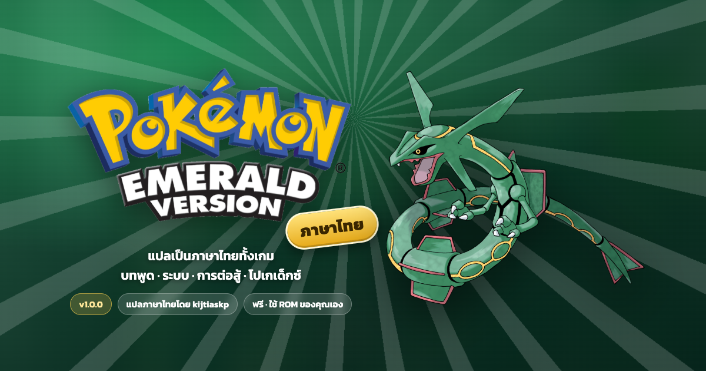

# Pokémon Emerald ภาษาไทย (pokeemerald-th)

แปล Pokémon Emerald เป็นภาษาไทยทั้งเกม บนฐาน decompilation [pret/pokeemerald](https://github.com/pret/pokeemerald)
แจกเป็นไฟล์ patch เท่านั้น ต้องใช้ ROM ของตัวเอง (`Pokemon - Emerald Version (USA, Europe)`, SHA-1 `f3ae088181bf583e55daf962a92bb46f4f1d07b7`)

## ใช้งาน patch (Windows / Mac / มือถือ)
1. เปิด **https://kijtiaskp.github.io/pokeemerald-th/** (หรือดาวน์โหลด `pokeemerald-th-patcher.html` จาก [Releases](https://github.com/kijtiaskp/pokeemerald-th/releases) แล้วดับเบิลคลิกเปิดในเบราว์เซอร์ ใช้ได้แบบออฟไลน์)
2. ลาก ROM ต้นฉบับมาวาง หน้าเว็บจะตรวจ SHA-1 ใส่คำแปล และให้บันทึกไฟล์ `.gba` ภาษาไทย ไฟล์ไม่ถูกส่งออกจากเครื่อง
3. ROM ที่ได้ต้องมี SHA-1 `fb378919bb14dad64c4ef4461932c725e2ada5af`

ทางเลือก: ใช้ `dist/pokeemerald-th.bps` กับ [Rom Patcher JS](https://www.marcrobledo.com/RomPatcher.js/) หรือ Floating IPS

## สิ่งที่แปล
- บทพูด ป้าย ข้อความระบบ การต่อสู้ ทีวี โปเกนาวี คำอธิบายโปเกเด็กซ์/ไอเท็ม/คุณสมบัติ easy chat (~16,300 ข้อความ)
- ชื่อโปเกมอน ตัวละคร และสถานที่ ใช้ชื่อญี่ปุ่นทับศัพท์ไทย (ฟุชิกิดาเนะ, ฮารุกะ, เมืองมิชิโระ)
- **คงภาษาอังกฤษ**: ชื่อท่า ชื่อธาตุ และชื่อไอเท็ม (ให้ค้นข้อมูลภาษาอังกฤษได้)
- ภาษาพูดตามเพศและนิสัยผู้พูด (ครับ/ค่ะ/นะ, ผม/ดิฉัน/ข้า ฯลฯ)

## โครงสร้าง
| path | หน้าที่ |
|---|---|
| `rom/` | submodule [kijtiaskp/pokeemerald-th-rom](https://github.com/kijtiaskp/pokeemerald-th-rom) (branch `thai`, tag `thai-engine` = engine ที่ยังเป็นข้อความอังกฤษ) |
| `tools/src/font/` | สร้างฟอนต์ไทยจาก GNU Unifont ลง glyph sheet ทั้ง 5 ฟอนต์ + width table + charmap |
| `tools/src/extract.ts` | ดึงข้อความทั้งหมด + บริบทผู้พูด → `tools/data/strings.jsonl` |
| `tools/data/translations/` | คำแปล (`{id, th}`) |
| `tools/src/validate.ts` | ตรวจ token, `$`, byte limit, ตัวอักษรที่รองรับ |
| `tools/src/insert.ts` | ตัดบรรทัดภาษาไทย (Intl.Segmenter + พจนานุกรมชื่อเฉพาะ) แล้วเขียนกลับ source จาก `thai-engine` |
| `tools/src/make-bps.ts` | สร้าง/ตรวจ BPS patch |
| `tools/src/make-patcher.ts` | สร้าง patcher หน้าเดียว (`dist/pokeemerald-th-patcher.html`, `docs/index.html`) และ `dist/banner.html` ฝัง BPS + รูปไว้ในไฟล์ |
| `tools/patcher/` | template หน้า patcher, hero และ `assets/` (โลโก้/Rayquaza/box art จาก Bulbapedia ผ่าน `npm run patcher:assets`, ฉากในเกมจาก mGBA) |
| `tools/qa/harness.lua` + `tools/src/qa.ts` | สั่ง mGBA (กดปุ่ม/ถ่ายภาพ/savestate) อัตโนมัติ |

การเปลี่ยนแปลงใน engine (`rom/`)
- `src/text.c`: วาดสระ/วรรณยุกต์ (zero-width) ซ้อนบน glyph ก่อนหน้าด้วยพื้นหลังโปร่งใส
- `src/text_marquee.c`: ข้อความบรรทัดเดียวที่กว้างเกินช่อง/ขอบ window เลื่อนแบบ marquee (ค้าง 1 วิ → เลื่อน → ค้างท้าย 3 วิ → กลับต้น) รวมถึงชื่อในกล่อง HP (`src/battle_interface.c`)
- `tools/preproc`: Thai shaping ตอน build (วรรณยุกต์ยกสูงเมื่อมีสระบน, เลื่อนซ้ายบน ป ฝ ฟ ฬ, แยก ำ)
- ชื่อโปเกมอนยาว 12 byte (เก็บ byte 11-12 ใน field ที่ไม่ใช้ของ `BoxPokemon` ขนาด save เท่าเดิม)
- ชื่อธาตุ 8 byte, ชื่อของตกแต่ง 19 byte, ลำดับคำ "โปเกมอน<หมวด>" ในโปเกเด็กซ์
- `make THAI_QA=1`: เกมใหม่เริ่มที่เส้นทาง 102 พร้อมปาร์ตี้/ไอเท็มทดสอบ

## Build
```sh
git clone --recurse-submodules https://github.com/kijtiaskp/pokeemerald-th && cd pokeemerald-th

# ครั้งแรก: devkit + agbcc + ฟอนต์ต้นแบบ
brew install arm-none-eabi-binutils arm-none-eabi-gcc libpng pkgconf
git clone https://github.com/pret/agbcc && (cd agbcc && ./build.sh && ./install.sh ../rom)
mkdir -p tools/vendor && curl -L https://unifoundry.com/pub/unifont/unifont-16.0.04/font-builds/unifont-16.0.04.hex.gz | gunzip > tools/vendor/unifont-16.0.04.hex

cd tools
npm run insert        # เขียนคำแปลลง rom/
npm run build:th      # insert + make → rom/pokeemerald.gba
npm run patch         # ต้องมี ../vanilla-src (git -C rom worktree add ../vanilla-src vanilla แล้ว make)
npm run patcher:assets # ดาวน์โหลดรูปสำหรับหน้า patcher (ครั้งแรก)
npm run patcher       # สร้าง patcher HTML จาก dist/pokeemerald-th.bps
npm run banner        # render docs/banner.png ด้วย headless Chrome
```

## ข้อจำกัดที่ทราบ
- ข้อความที่เป็นรูปภาพยังเป็นอังกฤษ: ไอคอนธาตุ, หัวข้อหน้า summary, เมนูโปเกนาวี, ปุ่มบนแป้นตั้งชื่อ, หน้า title
- แป้นตั้งชื่อยังเป็นอักษรละติน (ตั้งชื่อภาษาไทยไม่ได้)
- ชื่อเทรนเนอร์ทั่วไปทับศัพท์จากชื่ออังกฤษ (ไม่ทราบชื่อญี่ปุ่นต้นฉบับ)
- ส่วนสูง/น้ำหนักในโปเกเด็กซ์ยังเป็นหน่วยอิมพีเรียล (คำอธิบายใช้หน่วยเมตริก)
- โหมด A-Z ของ easy chat ยังจัดกลุ่มตามตัวอักษรอังกฤษ
- ตรวจในเกมแล้ว: ฉากเปิด, เมนูหลัก/START, ปาร์ตี้, summary, กระเป๋า, การต่อสู้ ยังไม่ได้เล่นจบทั้งเกม

## เครดิต
pret (pokeemerald, agbcc), GNU Unifont (glyph ต้นแบบ, SIL OFL / GPL font exception)

Pokémon, Pokémon Emerald Version, โลโก้ และภาพประกอบเป็นเครื่องหมายการค้าและลิขสิทธิ์ของ Nintendo, Creatures Inc. และ GAME FREAK inc. โปรเจกต์นี้เป็นงานแฟนเมดที่ไม่มีส่วนเกี่ยวข้อง และไม่แจกจ่าย ROM
